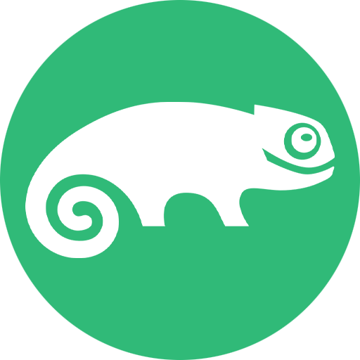

# Hello, I'm Elena 👨‍💻

Welcome to my GitHub profile! I'm a dedicated IT student at [Strasbourg University](https://iutrs.unistra.fr/english) now, but I am also ...

🌱 a professional translator, who used to work for the Council of Europe  
🌱 an amateur painter, especially good at portraits, they say  
🌱 pretty good Scrabble player (even won some local tournaments)  
🌱 a volunteer campaigning for human rights  
🌱 a Russian happily living and thriving in France  
🌱 "just" a mom and wife  
🌱 in my free time, I enjoy reading, hiking, and travelling  
  
---

## 🛠 Skills and Technologies

### Programming Languages

  
  
  
  
  
  
  

### Operating Systems

  
  
  
  
  

 

### Tools

  
  
  
  

---

<!--
## 📝 Projects

### [Project 1 Name](https://github.com/yourusername/project1)
- **Description:** A brief overview of what the project does.
- **Technologies Used:** Python, Flask, SQL
- **Achievements:** What you learned, or milestones you achieved.

### [Project 2 Name](https://github.com/yourusername/project2)
- **Description:** A brief overview of what the project does.
- **Technologies Used:** React, Node.js
- **Achievements:** Key features or personal highlights from this project. 

---

## 📈 GitHub Stats

  
  

